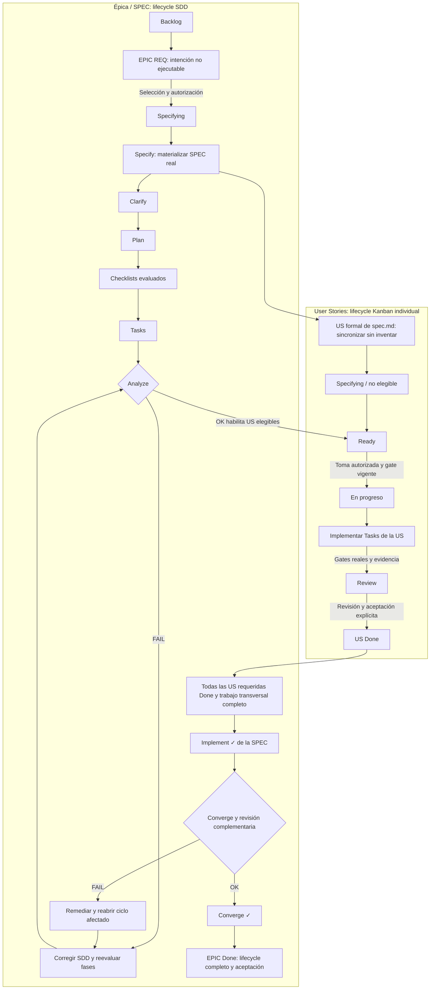

# Workflow operativo SDD + Trello + Git

## 1. Alcance, autoridad y lenguaje normativo

Este documento define el protocolo operativo para humanos y agentes. **MUST** significa obligación; **MUST NOT**, prohibición; **SHOULD/SHOULD NOT**, recomendación cuya excepción requiere justificación registrada; **MAY**, permiso opcional. No autoriza por sí mismo ejecutar fases, implementar, cambiar ramas ni escribir en Trello: el agente MUST actuar dentro del encargo recibido y ejecutar solo el paso solicitado.

El agente MUST leer el [AGENTS raíz](../../AGENTS.md), la [Constitution](../../.specify/memory/constitution.md) y las instrucciones específicas del área afectada. Los AGENTS específicos complementan al raíz dentro de su alcance. Este protocolo MUST NOT reinterpretar Constitution ni sustituir documentos normativos. Ante conflicto MUST detener la operación incompatible y solicitar resolución humana conforme a Constitution §9.

Fuentes existentes que MUST respetarse:

- Constitution §1, §4, §6–9: requisitos externos, sincronización, verificación, Git y Trello.
- [Estados de las specs](../../specs/README.md): `Draft`, `Ready for planning`, `Ready for implementation`, `Approved`.
- [Índice Trello](../../specs/trello.md): asociaciones bidireccionales, antecedentes y operaciones pendientes; no es prueba de aprobación.
- [Enunciado](../../tp/enunciado.md) y [entregas](../../tp/entregas.md): fuentes complementarias al especificar, aclarar, planificar, generar tareas, implementar y revisar.
- Comandos efectivos de Spec Kit en [`.opencode/commands/`](../../.opencode/commands/), scripts en [`.specify/scripts/bash/`](../../.specify/scripts/bash/) y plantillas en [`.specify/templates/`](../../.specify/templates/).

### Autoridad e infraestructura efectiva

Conforme a Constitution §1, la autoridad normativa máxima es Constitution. Los documentos normativos de área siguen siendo obligatorios en su alcance; este workflow detalla el protocolo y AGENTS/comandos lo ejecutan. La SPEC define intención funcional bajo esas normas; plan/Tasks/checklists desarrollan y evalúan esa intención. Trello registra estado operativo y Git implementación observada, sin poder redefinirla. No es una jerarquía que permita ignorar arquitectura/testing ni requisitos externos; ante conflictos obligatorios MUST aplicar Constitution §9.

1. **Requisitos futuros:** Constitution §8 establece `[EPIC] REQ-<id> - <nombre>`. Las claves heredadas con sufijos US/TSK del índice son antecedentes, no convención vigente ni unidades ejecutables; MUST preservarse hasta migración operativa autorizada, sin duplicar ni inferir estado.
2. **Comandos:** la infraestructura efectiva es `.opencode/commands/`; MUST leer la definición del comando correspondiente. Si falta, MUST reportar el bloqueo, no inventar una skill ni infraestructura futura.
3. **Orquestación asistida:** el [workflow YAML local](../../.specify/workflows/speckit/workflow.yml), versión 2.0.0, representa las ocho fases con gates humanos. MUST NOT ejecutarse de forma desatendida: un approve sin evidencia no completa fases. Implement está limitado a la US formal indicada y Converge espera todas las US requeridas Done; si quedan historias/revisiones, MUST rechazar ese gate y continuar mediante encargos separados, no reiniciar creando otra SPEC. Si aún no existe la SPEC/US, el input `user_story` MUST permanecer vacío, sin predecir identidad: el Ready Gate detiene esa pasada y la implementación se encarga posteriormente con una US real. Los handoffs no autorizan continuar automáticamente. El YAML no escribe Trello por sí mismo ni acredita sincronización; el registro conserva `source: bundled` como procedencia de instalación, no como afirmación de que la adaptación local permanezca idéntica al original.
4. **Specify local:** el comando utiliza el script de §5 para crear/reanudar identidad, carpeta y rama; MUST NOT repetir creación mediante copias o hooks alternativos ni sobrescribir una SPEC reutilizada.
5. **Verificación:** Constitution §6 gobierna comandos, plantillas y hooks: tests a cargo del usuario, sin ejecución directa/indirecta por agente. La aceptación no exige SonarQube ni gates opcionales.

La enmienda 5.0.0 alinea reglas e infraestructura; no migra tarjetas ni acredita fases históricas. La actualización o reinstalación de Spec Kit MUST preservar estas adaptaciones locales o reportar diferencias antes de operar.

## 2. Responsabilidades y trazabilidad

**EPIC → SPEC → User Story → Task → Code**:

| Elemento | Responsabilidad / fuente de verdad |
| --- | --- |
| EPIC | Tarjeta padre Trello para una feature/requisito completo; contexto y agregación, nunca unidad ejecutable. |
| SPEC | `specs/<nnn-feature>/`: SDD define verdad funcional en `spec.md` y diseño técnico en `plan.md` y artefactos relacionados, bajo normas globales. |
| User Story | Unidad funcional nacida de `spec.md`; tarjeta `SPEC-nnn | USnn - <título>`, ejecutable solo si es elegible y está en Ready. |
| Task | Paso técnico `Txxx` de `tasks.md`; no nace automáticamente como tarjeta. |
| Code | Implementación y su historial en Git. |

Trello define estado operativo; MUST NOT reemplazar requisitos ni decisiones SDD. `tasks.md` contiene el trabajo técnico necesario, dependencias y avance verificable, no aceptación funcional. Los agentes MUST mantener trazabilidad y sincronización dentro del trabajo autorizado.

`User Story 1` / `[US1]` en los artefactos corresponde a `US01` en Trello. MUST conservar números locales y antecedentes; MUST NOT renumerar por prioridad. Tarjetas técnicas `TSKnn` permitidas por Constitution son seguimiento excepcional y MUST referenciar sus `Txxx` cuando corresponda; no son US ni equivalen a Tasks.

**La existencia de un artefacto MUST NOT interpretarse como fase aceptada/completada.** Tampoco código, checkboxes de Tasks, un build, un merge o `Status` sustituyen evidencia de fase, revisión o pruebas.

## 3. Registro explícito e idempotente

La épica de una SPEC real SHOULD titularse `[EPIC] SPEC-nnn - <nombre>`. MUST enlazar carpeta, US, fuentes externas aplicables y antecedentes REQ. Las relaciones padre/hija MUST registrarse mediante enlaces reales en ambas direcciones y en `specs/trello.md`; no depender de una capacidad jerárquica no comprobada de Trello.

La épica MUST tener un checklist **SDD Lifecycle**, exactamente en este orden:

1. Specify
2. Clarify
3. Plan
4. Checklists
5. Tasks
6. Analyze
7. Implement
8. Converge

Para cada ejecución, el agente MUST registrar en la épica un comentario con: fase, fecha, responsable, alcance (SPEC/US), resultado `OK`, `FAIL`, `PENDING` o `INVALIDATED`, versión de entradas (commit o descripción de diff local), rutas/secciones evaluadas, evidencia, bloqueantes, verificaciones pendientes y siguiente acción. Para revisión/aceptación MUST incluir referencia a la decisión del usuario. Un informe generado en conversación MUST quedar referenciado o copiado en ese registro cuando se sincronice; no exigir que Analyze escriba archivos.

Una fase se marca `[x]` únicamente después de cumplir su condición de cierre, registrar evidencia y verificar lectura posterior del cambio. Si cambian entradas que invalidan una conclusión, MUST registrar `INVALIDATED`, desmarcar la fase y las sucesoras afectadas dentro del alcance autorizado y reevaluar las US afectadas. MUST NOT borrar antecedentes. Si faltan permisos/autorización, MUST detener la transición, informar y registrar operaciones pendientes en el índice conforme a Constitution §8.

Antes de escribir en Trello MUST releer tarjetas, buscar por clave y correspondencia confirmada, preservar ID, URL, miembros, comentarios, adjuntos, etiquetas y checklists. MUST NOT crear duplicados, archivar ni retirar alcance sin acuerdo. Después MUST verificar unicidad, asociaciones reales, resultado leído e índice actualizado. Si falla una escritura parcial, MUST releer antes de reintentar. Los estados heredados MUST conservarse y explicarse hasta revisión autorizada, no reinterpretarse como evidencia nueva.

## 4. Kanban y lifecycle SDD son dimensiones diferentes

Listas operativas: **Backlog → Specifying → Ready → En progreso → Review → Done**. La configuración real del tablero MUST comprobarse antes de operar; si falta una lista, MUST pedir habilitación, no crearla silenciosamente.

| Lista | EPIC | US |
| --- | --- | --- |
| Backlog | Intención futura sin preparación autorizada. | Historia formal aún no seleccionada/elegible; no implementar. |
| Specifying | Preparación Specify, Clarify, Plan, Checklists, Tasks, Analyze. | Historia formal cuya preparación o corrección está pendiente. |
| Ready | Preparación SDD satisfactoria, espera inicio. No es consumible como implementación. | Información validada y gate satisfecho. |
| En progreso | Implementación agregada iniciada. | US tomada por agente autorizado. |
| Review | US requeridas terminadas; cierre/Converge pendiente. | Implementación lista para revisión/aceptación. |
| Done | Implement y Converge satisfactorios, todas las US requeridas Done y aceptación de feature. | Revisión y aceptación explícita del usuario. |

La épica MAY permanecer En progreso mientras haya US en diferentes listas. MUST pasar a Review al completar Implement, y a Done solo tras Converge y aceptación. Estos movimientos requieren evidencia y autorización operativa; no son consecuencias automáticas de crear archivos.

`Status` de `spec.md` conserva la semántica de `specs/README.md`: Clarify satisfactorio permite `Ready for planning`; alineación validada de preparación permite `Ready for implementation`; `Approved` exige aceptación explícita de la feature. MUST NOT equiparar estos estados al Kanban de una sola US ni actualizarlos por mera existencia de artefactos.

## 5. Inicio y materialización

Un requisito futuro MUST representarse como `[EPIC] REQ-<id> - <nombre>` conforme a Constitution §8; por ejemplo, `[EPIC] REQ-S2-01 - Valuar jugadores con estrategias configurables`. MUST permanecer no ejecutable y MAY permanecer Backlog indefinidamente. MUST NOT inventar US/Tasks formales ni reservar `SPEC-nnn`.

Con selección explícita del usuario para preparar el requisito y autorización de seguimiento, el agente MUST revisar fuentes y specs existentes, mover la épica Backlog → Specifying y comenzar **solo la fase autorizada**. Si el requisito pertenece claramente a una SPEC existente, MUST reutilizarla; si no, Specify materializa una nueva.

Dentro de Specify, desde la raíz, el mecanismo efectivo es:

```bash
# Nueva SPEC: scope real en kebab-case; no pasar un número futuro.
.specify/scripts/bash/create-new-feature.sh --json --short-name '<scope>' '<requisito autorizado>'

# Reanudar SPEC existente: nombre exacto de directorio o scope inequívoco.
.specify/scripts/bash/create-new-feature.sh --json --reuse --short-name '<directorio-o-scope-existente>' '<trabajo autorizado>'
```

Son ejemplos parametrizados, MUST NOT ejecutarse con placeholders. MUST inspeccionar antes el script y efectos de hooks; no son controles de calidad ni habilitan tests. MUST leer salida `SPEC_NAME`, `SPEC_FILE`, `FEATURE_NUM`, `BRANCH_NAME`, `SPEC_ACTION`, `BRANCH_STATUS`. Si JSON no expone un campo requerido, MUST reportarlo y consultar salida efectiva, no suponer éxito. `--number` MAY desambiguar/validar **solo una identidad existente** con `--reuse`; MUST NOT reservar números futuros. `--allow-existing-branch` no sustituye `--reuse`.

El script asigna identidad real, conserva artefactos reutilizados y puede crear/reutilizar la SPEC aunque no logre cambiar rama. Un `BRANCH_STATUS` de fallo/omisión MUST bloquear trabajo que requiera esa rama; MUST NOT provocar otra SPEC como recuperación. Con cambios locales o HEAD separado MUST preservar trabajo, no hacer stash/reset automático.

MUST verificar que carpeta resuelta por `SPECIFY_FEATURE_DIRECTORY` / `.specify/feature.json` sea la solicitada; la última SPEC no determina la tarea y la rama no basta para resolverla. Los scripts pueden persistir esa selección. MUST comprobar rutas devueltas antes de cada fase.

Cuando la SPEC real exista, MUST asociar la épica a ella y conservar antecedente, tarjeta e historial cuando la correspondencia sea inequívoca. El paso conceptual `[EPIC] REQ-S2-01` → `[EPIC] SPEC-008 - Player Valuation` no predice el próximo número ni autoriza fusionar tarjetas cuya correspondencia no esté confirmada.

## 6. Protocolo de fases

En todas las fases MUST aplicar el registro de §3. La transición siguiente indica qué queda habilitado, **no** una autorización para ejecutarlo. Los comandos `/speckit.*` se ejecutan siguiendo su archivo homónimo en `.opencode/commands/`, subordinados a normas globales, alcance autorizado y gates de este documento. MUST inspeccionar hooks antes de invocarlos; MUST NOT ejecutar ninguno incompatible con prohibición de tests u otros límites.

### Specify → Clarify

- **Objetivo:** materializar alcance funcional y US reales, no diseñar implementación.
- **Precondiciones/entradas:** requisito seleccionado, fuentes externas leídas, búsqueda de SPEC relacionada y alcance autorizado; mecanismo de §5 resuelto.
- **Ejecución/artefactos:** seguir [`speckit.specify`](../../.opencode/commands/speckit.specify.md), usando carpeta/plantilla resueltas sin segunda creación; completar `spec.md` con US, escenarios, requisitos, criterios medibles, límites y supuestos. Evaluar checklist integrado `checklists/requirements.md`; preservar checklists equivalentes ya existentes.
- **Éxito/cierre:** SPEC no vacía ni plantilla, historias y alcance coherentes, evaluación de calidad registrada y sin bloqueantes de Specify. Solo entonces Specify `[x]`. Las decisiones relevantes pendientes MUST explicitarse y resolverse antes de habilitar su implementación; si impiden la validación, Specify queda pendiente y Clarify MAY ejecutarse para resolverlas.
- **Errores:** registrar faltantes, corregir dentro de autorización o solicitar aclaración; MUST NOT inventar requisitos. Sincronizar una tarjeta por US real al crear/reutilizar SPEC dentro del mismo trabajo, conforme a Constitution §8, inicialmente no Ready. No esperar Analyze para que exista seguimiento de US.

### Clarify → Plan

- **Objetivo:** eliminar ambigüedades funcionales relevantes.
- **Precondiciones/entradas:** SPEC real y fuentes; pendientes/evaluación Specify.
- **Ejecución/artefactos:** seguir [`speckit.clarify`](../../.opencode/commands/speckit.clarify.md); escanear cobertura, preguntar de a una (máximo cinco por sesión), registrar respuestas aceptadas en `spec.md`, actualizar secciones y reevaluar checklist integrado sin marcar checklists personalizados ajenos.
- **Éxito/cierre:** ninguna decisión funcional fundamental sin resolver; cobertura y respuestas registradas. Cero preguntas MAY producir OK si el escaneo acredita claridad. Clarify `[x]` y `Ready for planning` requieren esa evidencia.
- **Errores:** cuota agotada, respuesta ambigua o decisión pendiente implican PENDING y otra aclaración autorizada; MUST NOT tratar omisión/skip como completado. Sincronizar US afectadas.

### Plan → Checklists

- **Objetivo:** diseño técnico suficiente y alineado, sin decisiones fundamentales delegadas al implementador.
- **Precondiciones/entradas:** Specify/Clarify satisfactorios, SPEC, normas arquitectónicas y tecnológicas aplicables.
- **Ejecución/artefactos:** seguir [`speckit.plan`](../../.opencode/commands/speckit.plan.md), que utiliza `setup-plan.sh --json`; el script copia plantilla solo si falta el plan y conserva uno existente. MUST preservar contenido ajeno al alcance al actualizarlo. Completar `plan.md`, `research.md` y, según relevancia, `data-model.md`, `contracts/`, `quickstart.md`. Registrar por qué un artefacto no aplica. Validar Constitution Check antes y después del diseño.
- **Éxito/cierre:** decisiones resueltas, contratos/consumidores considerados, plan implementable, sin violaciones normativas ni contradicciones funcionales. Plan `[x]` solo con revisión de contenido registrada.
- **Errores:** gates fallidos o aclaraciones técnicas/funcionales pendientes bloquean transición; volver a fuente correspondiente, no usar Complexity Tracking para autorizar una excepción constitucional.

### Checklists → Tasks

- **Objetivo:** evaluar calidad, completitud y consistencia de requisitos por dominios aplicables, no probar el sistema.
- **Precondiciones/entradas:** SPEC y plan coherentes, inventario de riesgos y checklists existentes.
- **Ejecución/artefactos:** seguir [`speckit.checklist`](../../.opencode/commands/speckit.checklist.md) para generar checklists personalizados en `checklists/`. MUST registrar cuáles aplican y por qué; si ninguno adicional aplica, registrar justificación y evaluar el integrado. El revisor responsable evalúa cada criterio y registra evidencia/pendientes; generar un archivo no equivale a evaluarlo.
- **Éxito/cierre:** todos los criterios aplicables satisfechos o no aplicabilidad justificada por el revisor, sin bloqueantes. Checklists `[x]` exige evaluación registrada. Los personalizados son propiedad del revisor; el implementador MUST leerlos sin alterar marcadores.
- **Errores:** pendientes implican corrección/aclaración y reevaluación. Una autorización genérica para seguir con checkboxes abiertos MUST NOT eludir bloqueantes fundamentales ni Ready Gate.

### Tasks → Analyze

- **Objetivo:** descomponer alcance en trabajo técnico ejecutable y dependencias explícitas.
- **Precondiciones/entradas:** SPEC, plan, evaluación de checklists y artefactos técnicos relevantes.
- **Ejecución/artefactos:** seguir [`speckit.tasks`](../../.opencode/commands/speckit.tasks.md), usando `setup-tasks.sh --json` y plantilla resuelta; generar/mantener `tasks.md`. Formato: `- [ ] Txxx [P?] [USn] <acción con ruta>`. `[P]` solo sin conflictos/dependencias; tareas compartidas/fundacionales y transversales MAY no tener etiqueta US, pero MUST explicitar a quién habilitan. Incluir tests backend necesarios según normas del proyecto, sin tareas de ejecución por agente ni tests frontend.
- **Éxito/cierre:** cobertura de cada US/requisito, rutas, dependencias y condiciones de verificación suficientes; no tareas ejemplo ni requisitos inventados. Tasks `[x]` significa desglose validado, **no** Tasks técnicas implementadas.
- **Errores:** cobertura insuficiente bloquea Analyze exitoso; preservar IDs y avance existente al reanudar, MUST NOT regenerar destructivamente ni convertir automáticamente Tasks en tarjetas.

### Analyze → Ready Gate

- **Objetivo:** validar consistencia cruzada y habilitar implementación informada.
- **Precondiciones/entradas:** preparación anterior satisfactoria; `spec.md`, `plan.md`, `tasks.md`, checklists, fuentes/normas y dependencias.
- **Ejecución/artefactos:** seguir [`speckit.analyze`](../../.opencode/commands/speckit.analyze.md), con `check-prerequisites.sh --json --require-tasks --include-tasks`; análisis estrictamente de lectura. Producir informe con hallazgos, severidad, referencias y cobertura; registrar evidencia en Trello por §3 fuera del comando de análisis. No hay archivo de informe obligatorio.
- **Éxito/cierre:** informe sin bloqueantes y cobertura suficiente para la SPEC. Son bloqueantes CRITICAL, HIGH, violaciones normativas, decisiones fundamentales pendientes y cualquier inconsistencia que impida determinar comportamiento correcto, aunque su etiqueta sea menor. Hallazgos menores MAY quedar abiertos con impacto, responsable y justificación explícitos. Analyze `[x]` solo tras resultado global satisfactorio.
- **Errores:** `Analyze FAIL → corrección autorizada de artefactos → reevaluación de fases afectadas → Analyze nuevamente`. Analyze MUST NOT corregir por sí mismo. Las US afectadas MUST NOT pasar a Ready. Un resultado parcial MUST NOT registrarse como Analyze global OK; este protocolo espera OK global antes de nuevas admisiones a Ready. Un bloqueo nuevo limitado a una US después de OK MUST invalidar su elegibilidad y reevaluar impactos, no ocultarse.

**Ready significa que SDD produjo suficiente información validada para que un agente implemente la User Story sin inventar requisitos o decisiones fundamentales.**

Para mover cada US a Ready MUST comprobar, conjuntamente:

1. US existente y estable en `spec.md`, tarjeta única y enlaces correctos.
2. Planificación suficiente y Tasks específicas más prerrequisitos compartidos definidos.
3. Checklists aplicables evaluados, Analyze OK vigente sobre entradas actuales y ausencia de bloqueantes que afecten a la US.
4. Dependencias de otras US resueltas; trabajo fundacional pendiente solo MAY incluirse si está explícitamente asignado al alcance autorizado de esa US y ordenado antes de sus Tasks específicas.
5. Evidencia de elegibilidad registrada y autorización operativa para moverla.

La sincronización de tarjetas nace con US reales durante Specify/reutilización y continúa ante cambios; **Analyze habilita Ready, no crea contenido funcional de historias**.

### Implement → Converge (a nivel SPEC)

- **Objetivo:** implementar toda la SPEC mediante US elegibles, no consumir una épica ni todas las Tasks indiscriminadamente.
- **Precondiciones/entradas:** US autorizada en Ready y gate vigente, SDD relevante, código/consumidores/tests/configuración, rama correcta.
- **Ejecución/artefactos:** seguir §7 y [`speckit.implement`](../../.opencode/commands/speckit.implement.md) limitado a Tasks de esa US y prerrequisitos autorizados. Modificar código, tests backend aplicables, documentación/contratos y avance de `tasks.md`; mantener evidencia Git/Trello.
- **Éxito/cierre:** cada US cumple su lifecycle hasta Done, más trabajo compartido/transversal requerido efectivamente completado. **Implement `[x]` solo cuando todas las US requeridas estén Done**, nunca porque US01 está Done. Registrar matriz de US/Tasks/evidencias, con verificaciones pendientes separadas.
- **Errores:** fallo o divergencia bloquea transición de US/SPEC afectada; preservar avance, resolver fuente correcta y reevaluar gate. No disminuir alcance ni marcar Tasks no verificadas para cerrar.

### Converge → EPIC Done

- **Objetivo:** gate final de consistencia de la SPEC completa.
- **Precondiciones/entradas:** Implement satisfactorio; todas las US requeridas Done; SDD, implementación, documentación, interfaces, evidencias y trazabilidad actuales.
- **Ejecución/artefactos:** seguir [`speckit.converge`](../../.opencode/commands/speckit.converge.md). Evalúa intención contra código; su única escritura permitida es anexar Tasks de remediación en nueva fase Convergence de `tasks.md`, con nuevos IDs, referencias y severidad; MUST NOT reescribir SPEC/plan/Tasks previas ni modificar código. Sin hallazgos MUST dejar `tasks.md` intacto. Complementar **fuera de ese comando** la revisión de checklists, US/Tasks, evidencia de tests/pending, documentación, contratos y trazabilidad Trello ↔ SDD ↔ Git, porque el comando no inspecciona Git/historial.
- **Éxito/cierre:** sin divergencias relevantes ni remediaciones necesarias; cobertura final y trazabilidad verificadas; pendientes de tests explícitos tratados conforme a §8, nunca como PASS. Converge `[x]` exige tanto resultado limpio del comando como revisión complementaria satisfactoria registrada.
- **Errores:** hallazgos implican Converge FAIL, épica no Done; identificar fuente de verdad, anotar correcciones, invalidar Implement/US afectadas cuando proceda. Tasks anexadas MUST mapearse a US existentes o trabajo compartido autorizado; MUST NOT inventar US ni ejecutar Tasks fuera del Ready Gate. Corregir artefactos solo en paso separado autorizado, repetir Analyze si cambia preparación, reimplementar/revisar/aceptar US afectadas y repetir Converge.

MUST NOT modificar retroactivamente SPEC para justificar implementación incorrecta. Si el cambio funcional es realmente deseado, requiere decisión explícita y reapertura de SDD antes de implementarlo.

## 7. Ejecución de una User Story

El agente MUST evaluar: **¿es una US real de una SPEC, está en Ready, tiene gate vigente y está autorizada?** Si no, MUST NOT implementar. EPIC, Backlog, US en Specifying y tarjetas técnicas no son entradas ejecutables de este protocolo.

Secuencia obligatoria:

1. Identificar `SPEC-nnn` y US; localizar carpeta exacta en `specs/`, no asumir la de mayor número.
2. Leer AGENTS aplicables, Constitution, este workflow, `spec.md`, plan y artefactos relevantes; revisar fuentes externas aplicables.
3. Identificar `Txxx` de `[USn]`, tareas compartidas, dependencias y límites autorizados; releer código, consumidores, tests y configuración afectados.
4. Revisar `git status --short` y diff; preservar cambios ajenos y archivos sin seguimiento. Comprobar rama y resolución efectiva de la SPEC.
5. Verificar Analyze/evaluaciones vigentes, bloqueantes y disponibilidad operativa. Si faltan evidencias, detener toma, no completar el registro por inferencia.
6. Registrar responsable, alcance y evidencia de toma; mover US Ready → En progreso, verificar lectura posterior y actualizar índice. Actualizar estado agregado de épica cuando corresponda. Si no puede registrarse la toma, MUST detener inicio hasta recuperación/acuerdo explícito.
7. Implementar solo Tasks autorizadas en orden de dependencias; `[P]` no autoriza solapar archivos ni delegar sin permiso. Prerrequisitos compartidos se completan antes de las Tasks específicas.
8. Actualizar checkboxes solo por trabajo realizado y verificado. Una Task que pide **ejecutar/verificar tests** MUST permanecer pendiente hasta evidencia del usuario; escribir tests no acredita ejecutarlos. Separar pendientes de verificación de implementación.
9. Aplicar gates reales de §8, mantener contratos/documentación coherentes y trazabilidad de §9. No modificar silenciosamente SPEC ni checklists del revisor.
10. Registrar entrega, Tasks completadas, cambios, evidencia y pendientes; mover US En progreso → Review únicamente si cumple gates. No marcarla Done por decisión unilateral del implementador.

**Review** significa implementación terminada según el agente y lista para revisión/aceptación, no funcionalidad ya aprobada. Ante rechazo MUST registrar motivos y volver a En progreso para corrección autorizada si el gate sigue vigente; si invalida SDD, volver a Specifying, corregir y pasar nuevamente por Ready.

**Review → Done** exige revisión de escenarios/criterios de aceptación y alcance, ausencia de bloqueantes atribuibles al cambio, evidencia disponible y **aceptación explícita del usuario**, registrada con referencias. Tests pendientes MUST seguir visibles y MAY coexistir con aceptación conforme a Constitution §6 si no existe condición funcional específica que exija su resultado. Si esa condición existe o no hay decisión suficiente, MUST pedir evidencia/decisión y mantener Review. Un merge o código relacionado MUST NOT equivaler automáticamente a Done.

## 8. Gates reales de verificación y entrega

Antes de Review el agente MUST revisar coherencia de SPEC/plan/Tasks/código/contratos/docs y criterios aplicables, diff final, `git diff --check` y `git status --short`. MUST distinguir fallos del cambio de fallos preexistentes verificablemente ajenos y problemas del entorno.

| Cambio | Control permitido al agente |
| --- | --- |
| Código backend | `./gradlew build -x test` desde `backend/`, según [AGENTS backend](../../backend/AGENTS.md). |
| Código frontend | `npm run build` desde `frontend/`, según [AGENTS frontend](../../frontend/AGENTS.md). |
| Ambos | Ambos builds, sin tests. |
| Solo documentación | Revisión de rutas, enlaces, comandos, coherencia y diff; sin build. |

MUST NOT ejecutar tests directa o indirectamente. Para backend MUST crear/modificar los tests necesarios conforme a [testing](../backend/testing.md) y pedir al usuario casos concretos y salida cuando haga falta evidencia. Frontend está temporalmente exento: MUST NOT crear/ejecutar tests ni incorporar su infraestructura. MUST NOT ejecutar otros controles de calidad desde el agente; SonarQube y gates opcionales quedan a cargo del usuario y no condicionan entrega.

Build aprobado permite entrega con tests backend explícitamente pendientes; no permite afirmar criterios funcionales comprobados por tests. Fallo nuevo del build bloquea Review; fallo preexistente verificablemente ajeno MAY no bloquear conforme a Constitution §6, con evidencia y reporte. Fallo de entorno sin clasificación suficiente MUST dejar gate pendiente y solicitar resolución, no declararse aprobado.

Los hooks y CI existentes no acreditan ejecución: `pre-commit` ejecuta controles adicionales, `pre-push` ejecuta tests backend y CI puede ejecutar build con tests. Antes de commit/push MUST inspeccionar configuración efectiva y hooks; MUST NOT disparar indirectamente controles prohibidos ni deshabilitarlos por cuenta propia. Si la operación los dispara, MUST entregar cambios y mensaje propuesto al usuario para que realice la operación. Publicación y pruebas remotas quedan a cargo del usuario; reportar solo resultados observados.

## 9. Git y evidencia de implementación

MUST mantener **SPEC ↔ US ↔ Tasks ↔ Branch ↔ Commits ↔ Code ↔ PR**, sin imponer una rama por US ni un commit por Task.

- Antes de crear/proponer rama MUST inspeccionar specs existentes. Constitución §7 exige `<type>/<spec-id>-<scope>` para cambio ligado a SPEC, o `<type>/<scope>` para cambio independiente pequeño/técnico. Tipos de rama: `feat`, `fix`, `refactor`, `test`, `docs`, `chore`, `perf`, `ci`; scope kebab-case. Ejemplo ilustrativo: `feat/008-player-valuation`, solo si existe la SPEC 008 pertinente.
- Directorio `008-player-valuation` no lleva `feat/`. Reanudación MUST reutilizar identidad/rama según §5, no asignar otro número. Rama incorrecta, HEAD separado o trabajo ajeno MUST bloquear operaciones incompatibles; no checkout/reset/stash destructivo.
- Commits MUST seguir formato efectivo de [commit-msg](../../.githooks/commit-msg): `type(scope): description` o `type: description`. Mensajes y títulos de PR MUST estar en inglés según Constitution §5. Tipos de commit admitidos por el hook incluyen además `style` y `build`; MUST NOT trasladarlos a ramas, cuya lista es distinta.
- Cada grupo lógico de cambios MUST mapearse a SPEC/US/Tasks en el cuerpo del commit o en registro de entrega/PR con hashes reales. SHOULD usar cuerpo como `SPEC-008 | US01 | T012, T013`; el encabezado conserva convención existente. Cambios compartidos MUST declarar todas las US afectadas, no adjudicarse arbitrariamente a una.
- PR MUST referenciar SPEC y rama; SHOULD incluir US, Tasks, criterios, evidencia, pendientes y tarjetas reales. MUST NOT inventar URL/hash ni presentar enlaces GitHub como prueba de publicación local.
- Para Review MUST existir diff revisable y trazabilidad, aunque commit/publicación estén pendientes del usuario por hooks. MUST registrar explícitamente esos pendientes. Para Done MUST registrar la revisión/aceptación de la versión exacta; aceptación de diff local no implica merge/publicación. MUST NOT agregar un requisito global de merge que las reglas existentes no definen.
- MUST NOT incluir trabajo previo ajeno, crear commits/ramas o publicar sin autorización. Los cambios documentales de este protocolo no requieren crear una SPEC ni reutilizar artificialmente una rama de feature.

## 10. Failure / Recovery

**Ante una inconsistencia que impida determinar el comportamiento correcto, el agente MUST detener la transición afectada y reportar el problema antes de inventar información.** MUST registrar fuente, evidencia, alcance afectado, estado real, propuesta de recuperación y decisión requerida. Reportar no equivale a autorizar corrección/movimiento; MUST preservar historial y trabajo ajeno.

| Problema | Acción obligatoria / condición de reanudación |
| --- | --- |
| SPEC inexistente | No implementar; comprobar referencia/resolución. Solicitar Specify autorizado o corregir asociación confirmada. No inventar número/carpeta. |
| EPIC sin SPEC | Mantener intención no ejecutable; preparar en Specifying solo por decisión explícita. |
| US inexistente en `spec.md` | Bloquear ejecución/Ready; reportar tarjeta inválida. Formalización funcional requiere Specify/Clarify autorizado, no copiar tarjeta como verdad. |
| US sin Tasks suficientes | Volver a preparación afectada; completar desglose autorizado, reevaluar cobertura y Analyze. |
| Analyze con bloqueantes | No admitir US afectadas a Ready; corregir fuentes autorizadas y repetir Analyze. No cambiar severidad para eludir gate. |
| Trello contradice `spec.md` | SPEC gobierna contenido; detener transición y proponer sincronización preservando antecedente. Si SPEC contradice fuentes/normas, escalar en vez de obedecer tarjeta. |
| `tasks.md` contradice código | Inspeccionar implementación y requisito; no asumir checkbox correcto. Registrar avance real y remediación; no marcar verificación inexistente. |
| Implementación divergente | Detener Review/Done; corregir implementación o acordar cambio funcional mediante reapertura SDD. No adaptar retroactivamente SPEC. |
| Artefactos incompletos | Identificar fase faltante y completar solo con autorización. Archivo vacío/plantilla no es evidencia de cierre. |
| Rama incorrecta | Detener escritura/commit incompatible, preservar cambios y pedir resolución segura; no mover cambios ajenos ni crear otra SPEC. |
| Trabajo parcial | Registrar Tasks realmente completas, pendientes y versión; retomar tras verificar gate y estado. No reiniciar borrando avance ni afirmar US terminada. |
| US movida incorrectamente | Bloquear consumo/transición; releer evidencia y proponer regreso a lista válida. Aplicar corrección solo autorizada y registrar motivo; conservar estados heredados hasta revisión. |
| Fase marcada sin evidencia | Tratar como no acreditada; registrar INVALIDATED y reevaluar. Desmarcar con autorización, no reconstruir aprobación por inferencia. |
| Cambio de alcance descubierto | Detener trabajo afectado; pedir decisión funcional. Si se acepta, modificar SDD en paso separado, sincronizar, invalidar gates afectados y repetir preparación antes de implementar. |
| Converge falla | Épica no Done; anexar remediación según comando, mapear US/Tasks y reabrir ciclo afectado. Repetir cierre Implement y Converge tras corregir/aceptar. |
| Trello inaccesible / escritura parcial | Registrar operaciones pendientes en índice, reportar bloqueo; releer al reanudar, no duplicar ni afirmar sincronización. |
| Tests/evidencia pendientes | Mantener pendiente explícito; pedir salida al usuario cuando sea necesaria. No ejecutarlos ni convertir ausencia en PASS. |

## 11. Diagrama y cierre



El paso desde US no elegible a Ready MUST cumplir Analyze OK y todas las condiciones de §6, no solo la flecha del diagrama.

Para cerrar la épica MUST comprobar los ocho items `SDD Lifecycle` satisfechos con evidencia vigente, todas las US requeridas Done, trabajo compartido/transversal terminado, Converge limpio y revisión complementaria satisfactoria, aceptación explícita de feature, trazabilidad e índice sincronizados. Solo entonces MUST registrar cierre, actualizar `Status` a `Approved` si corresponde y mover EPIC → Done dentro de autorización. MUST mantener visibles tests/publicación pendientes permitidos y MUST NOT inventar el estado histórico de ninguna SPEC.

La adopción de este documento **no ejecuta el lifecycle**, no migra Trello ni acredita fases de specs existentes. Cada regularización posterior requiere encargo, inspección y evidencia propios.
